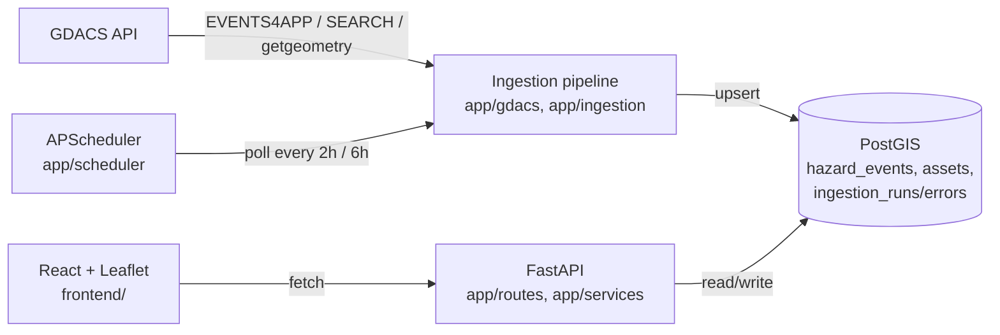
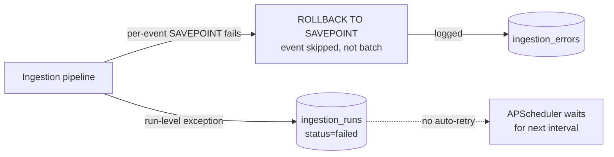

# ClimRisk — Architecture

South Africa-focused climate hazard exposure platform: a GDACS ingestion pipeline feeds a
PostGIS database, a FastAPI service exposes spatial-financial queries over it, and a React
dashboard visualizes hazard footprints against insured asset exposure. This document records
*why* the system is shaped the way it is — the decisions, the alternatives considered, and the
constraints that forced them — not just what the code does.

## System overview



Three deployable pieces: the ingestion service (scheduled + on-demand), the read/query API
(exposure intersection, map data), and the frontend (a static SPA that talks to the API over
HTTP). They share one database and nothing else — the frontend has no direct DB access, and the
ingestion pipeline has no dependency on the API layer.

**Failure path.** The happy path above hides a parallel error path that's equally load-bearing:



A malformed feature fails its own `SAVEPOINT` and is logged to `ingestion_errors` without aborting
the batch (see "Per-event fault isolation" below). A run-level exception (GDACS unreachable, DB
error before commit) is caught in [realtime.py](../app/ingestion/realtime.py) /
[polygons.py](../app/ingestion/polygons.py): the transaction rolls back, the error is logged, and
the run row is marked `failed` in `ingestion_runs` before the exception is re-raised. Both tables
are the only record of what went wrong — there's no alerting on top of them yet, so a stuck
ingestion currently surfaces only if someone queries `ingestion_runs`/`ingestion_errors` or reads
the process log.

## Backend

### Repository pattern over an ORM

[app/db/repository.py](../app/db/repository.py) is hand-written parameterized SQL via
`psycopg2`, not SQLAlchemy or another ORM. For a project this size, with PostGIS-specific
functions (`ST_MakePoint`, `ST_Intersects`, `ST_GeomFromGeoJSON`, `ST_AsGeoJSON`) on almost every
query, an ORM's geometry abstraction layer would add indirection without saving real effort —
the SQL is already short and the PostGIS calls are the point, not incidental. A plain
`SimpleConnectionPool` ([app/db/pool.py](../app/db/pool.py)) with a `get_connection()` context
manager is the whole data-access layer.

### Ingestion: three separate jobs, one shared processing path

[app/ingestion/](../app/ingestion) has `realtime.py`, `backfill.py`, and `polygons.py` — three
entry points, all funneling through [process_features()](../app/db/repository.py) in the
repository, which does the actual parse → upsert → error-log work. Splitting them
matches GDACS's own API shape (EVENTS4APP is a global "current events" feed with no date range;
SEARCH is paginated historical; geometry is fetched per-event) and lets each run on its own
schedule (realtime every 2h, polygons every 6h — [app/scheduler/jobs.py](../app/scheduler/jobs.py)).

**Per-event fault isolation.** `process_features()` wraps each event in a `SAVEPOINT`/`ROLLBACK
TO SAVEPOINT`, so one malformed GDACS feature fails and gets logged to `ingestion_errors`
without aborting the whole batch or losing the events already processed in that transaction.
Commits are chunked (`ingest_commit_chunk_size`, default 20) rather than one commit per event or
one per batch — a balance between crash-safety and round-trip overhead.

**Scheduled job failures don't retry before the next interval, by design.**
[`_safe_realtime`/`_safe_polygons`](../app/scheduler/jobs.py) wrap each job in a bare
`try/except Exception: log.exception(...)` — a failed run (GDACS down, DB unreachable) is logged
and the job simply waits for its next `IntervalTrigger` tick (every 2h / 6h) rather than
backing off and retrying sooner. `max_instances=1` and `coalesce=True` mean a slow or stuck run
can't pile up overlapping executions, and a missed tick collapses into the next one instead of
firing a backlog. This is a coarser retry policy than the HTTP-level `tenacity` retries inside
each request — deliberately so: a whole-job retry loop competing with the next scheduled interval
would risk overlapping runs against the same rows. If a run fails after `start_run()` succeeded,
it's visible in `ingestion_runs`/`ingestion_errors` (see "Failure path" above); if the DB
connection itself never opens, the only record is the process log.

**Ingestion stores the world; country scoping lives in the read queries.** GDACS's `SEARCH`
endpoint has a `country` query parameter — but it expects a full country name ("South Africa"),
not an ISO3 code, and silently returns `204 No Content` for any ISO3 value tested (confirmed
against multiple countries, not ZAF-specific), so it is never sent. Both feeds are therefore
worldwide, and `process_features()` stores **every** event — there is no country filter at
ingestion time. Scoping to South Africa happens once, in SQL, on the read side:
`/hazards` (default), [`run_hazard_trends()`](../app/services/trends.py),
[`evaluate_all_events()`](../app/services/parametric.py), and
[`fetch_pending_polygons()`](../app/db/repository.py) all carry
`iso3 = %s OR %s = ANY(affected_countries)`; [`run_intersection()`](../app/services/intersection.py)
is per-footprint against South-African-only `assets`. A flood in Indonesia lands in
`hazard_events` but can never intersect an asset and never appears in a SA-scoped view. The one
route that opts out is `GET /hazards?scope=global`, which drops the `WHERE` for the 3D globe
view — same table, same endpoint, no filter. `event_affects_country()` in
[parser.py](../app/gdacs/parser.py) is kept as a utility but is no longer wired into ingestion.

**Footprint selection prefers area geometry over the marker point.** GDACS's geometry endpoint
returns `features[0]` as a bare `Point` (the event marker) followed by the real
`Polygon`/`MultiPolygon` footprint(s) — and for cyclones, dozens of per-forecast-point cone
polygons interleaved with track `LineString`s.
[`fetch_geometry()`](../app/gdacs/client.py) walks the feature list and returns the first
`Polygon`/`MultiPolygon` it finds, falling back to whatever geometry exists (a bare point) only
if no area geometry is present. This is a deliberately partial fix for cyclones — it stores the
first cone segment, not a unioned track corridor — rather than solving full multi-episode track
aggregation as a side effect of a bug fix.

**Geometry is validated and repaired before storage.**
[`validate_geometry()`](../app/gdacs/parser.py) runs Shapely's `make_valid()` on every incoming
footprint. GDACS's flood polygons are dense (thousands of vertices) and not always
topologically clean; `make_valid()` can legitimately return a `GeometryCollection` rather than a
clean `Polygon` when repairing a self-intersecting input. Downstream consumers (the intersection
query, the frontend) are written against generic PostGIS predicates (`ST_Intersects`,
`ST_Area(geography)`) that work correctly regardless of the exact geometry subtype, rather than
assuming `footprint` is always a `Polygon`/`MultiPolygon`.

### Database

**PostGIS only — no TimescaleDB.** Even worldwide, GDACS event volume is modest (thousands of
rows, not millions); a GiST index on `centroid`/`footprint` plus a plain btree on `from_date`
is the actual bottleneck-relevant index, not time-partitioning. Timescale would be a second
system to operate for no queried workload that needs it.

**Country scoping is indexed for the worldwide table.** Since ingestion went global
([009_global_events.sql](../db/migrations/009_global_events.sql)), every SA-scoped read filters
`iso3 = %s OR %s = ANY(affected_countries)`. That is covered by `idx_hazard_events_iso3` (btree)
BitmapOr'd with `idx_hazard_events_affected_countries` (GIN, migration 004) — the country
predicate narrows to a few hundred rows before any spatial join or sort runs, so global volume
never reaches the expensive part of a query. `009` also drops the old ZAF-hardcoded partial
index (`WHERE iso3 = 'ZAF'`, which a parameterised filter could never use) for a plain
`(iso3, from_date DESC)` composite.

**Migration house style** ([db/migrations/](../db/migrations)): numbered (`NNN_topic.sql`),
header-commented, and every DDL statement is idempotent (`CREATE TABLE IF NOT EXISTS`,
`ADD COLUMN IF NOT EXISTS`, `CREATE INDEX IF NOT EXISTS`) so migrations are safe to re-run.
`BIGSERIAL` surrogate keys, `TIMESTAMPTZ` for every temporal column, `NUMERIC` for money/scores,
`JSONB` for raw/opaque payloads. Indexes are named `idx_<table>_<column>`, and partial indexes
are only added when they mirror a real query the application actually runs (e.g.
`idx_hazard_events_footprint_pending ... WHERE footprint IS NULL AND geometry_url IS NOT NULL`
exists because [`fetch_pending_polygons()`](../app/db/repository.py) runs exactly that filter).

**Dedup via a natural key, not the surrogate PK.** `hazard_events` has
`UNIQUE (event_type, event_id, episode_id)` — GDACS's own composite identifier — as the
`ON CONFLICT` target for upserts. The `id BIGSERIAL` surrogate key exists for foreign keys and
for the intersection service to name "one specific footprint row" unambiguously (see below), not
for dedup.

**Application role has no schema-modification rights, by design and by accident-turned-design.**
`climrisk_app` (the credential the app actually connects as) was originally granted nothing at
all on any table — a real bug caught by testing the live permission set rather than assuming the
migrations that created the tables also granted access to the app role. The fix
([005_grant_app_role.sql](../db/migrations/005_grant_app_role.sql)) grants `climrisk_app`
`SELECT/INSERT/UPDATE/DELETE` plus `ALTER DEFAULT PRIVILEGES` — so every table created by later
migrations (`assets` in `006`, and anything after) inherits the grant automatically, without a
per-migration grant statement, as long as they're applied by the same admin role. `climrisk_app`
still can't `CREATE TABLE` — schema changes require the table owner, matching how every migration
so far has actually been applied.

**`assets.total_insured_value` is a generated column, not application-computed.**
`GENERATED ALWAYS AS (building_value + contents_value) STORED` in
[006_assets.sql](../db/migrations/006_assets.sql) means TIV can never drift from its inputs —
there's no code path that writes `building_value` without `total_insured_value` recomputing, and
no risk of a forgotten recalculation in some other write path.

### Spatial-financial intersection service

[app/services/intersection.py](../app/services/intersection.py) is the one query the exposure
dashboard is built on: given a hazard event, find every asset whose `location` intersects its
`footprint`, and total their exposure.

**Takes `hazard_events.id` (the surrogate key), not GDACS's own `event_id`.** A single GDACS
`event_id` can have multiple `episode_id` rows over time as an event evolves, each with its own
footprint — "the event" isn't a single row. The surrogate key is the only unambiguous way to
name one specific footprint to intersect against.

**The intersection query passes the footprint as a subquery, not a join.**
```sql
SELECT ... FROM assets a
WHERE ST_Intersects(a.location, (SELECT footprint FROM hazard_events WHERE id = %s))
```
rather than joining `assets` to `hazard_events` and filtering on `h.id`. This keeps the GiST
index on `assets.location` doing the real work against one bound geometry, and keeps the query
legible as "assets vs. this one footprint" rather than a join whose filter placement the reader
has to reason about.

**A no-footprint event returns an empty result, not an error.** Not every ingested event has had
polygon enrichment run yet; `run_intersection()` checks `footprint IS NOT NULL` first and returns
zero assets with `has_footprint: false` rather than attempting (and failing) a spatial query
against a null geometry. A genuinely nonexistent `hazard_events.id` raises `ValueError`, which the
API layer maps to `404`.

**PML and Protection Gap are computed alongside Exposure, not deferred.** The ClimRisk Master
Document's Section 4.8 build sequencing puts both in this same step (Financial Dashboard), not a
later phase, so [`IntersectionResult`](../app/services/intersection.py) computes them as
properties on the same result Exposure already comes from — no second query, no separate
endpoint. `probable_maximum_loss = total_insured_value × damage_ratio`; `protection_gap =
total_insured_value − total_declared_insured_value`.

**The damage ratio is a documented approximation, not a calibrated model.**
[`app/services/damage_ratio.py`](../app/services/damage_ratio.py) hard-codes the HAZUS-MH/FEMA
band midpoints the master document cites (e.g. flood minor 0.05–0.15, flood major 0.30–0.60) —
cited convention, not invented numbers. The master document calibrates each band against
hazard-specific severity (flood depth in metres, cyclone category) that GDACS doesn't expose to
this pipeline; as a stand-in, GDACS's own `alert_level` (Green/Orange/Red) selects between a
hazard's "minor" and "major" band, and the band **midpoint** is used rather than calibrating
further within it — the same simplification the master document names explicitly as a future
improvement, not silently glossed over. Hazard types with no documented band (EQ, VO, DR) fall
back to a single conservative placeholder band, logged each time it's used so the fallback stays
visible rather than reading as a researched figure.

**Protection Gap treats an asset with no declared `insured_value` as fully uninsured, not
excluded.** `assets.insured_value` ([007_insured_value.sql](../db/migrations/007_insured_value.sql))
is nullable — most assets in a demo dataset won't have it populated. `total_declared_insured_value`
sums `insured_value OR 0` rather than skipping nulls, so an undeclared asset counts toward the gap
at its full TIV. This is a deliberate conservative default (matches the project's "state the
simplification" instinct elsewhere): it means the gap can currently overstate real uninsured
exposure for assets that are actually insured but just haven't had the field filled in, and that
trade-off is worth knowing before the number is quoted anywhere.

### Historical / trend service

[app/services/trends.py](../app/services/trends.py) answers the *other* question the dashboard
asks — how hazard frequency, alert level, and insured exposure have moved over time — and it
**does not** loop [`run_intersection()`](../app/services/intersection.py) once per event to do
it. That service opens its own connection and is shaped for "one footprint, in detail"; the
trend view needs the same TIV / PML / Protection-Gap numbers for *every* event at once, so
`run_hazard_trends()` uses a single grouped spatial join instead:

```sql
SELECT h.id, h.event_type, h.alert_level, ...,
       COUNT(a.id), COALESCE(SUM(a.total_insured_value), 0), COALESCE(SUM(a.insured_value), 0)
FROM hazard_events h
LEFT JOIN assets a ON h.footprint IS NOT NULL AND ST_Intersects(a.location, h.footprint)
WHERE h.iso3 = %s OR %s = ANY(h.affected_countries)
GROUP BY h.id ORDER BY h.from_date
```

The `LEFT JOIN` (not `INNER`) is load-bearing: an event with no footprint yet, or none of the
assets inside it, still comes back with zeroes rather than dropping out of the series — the same
"empty, not an error" contract the intersection service gives. The per-event financial formulas
(`probable_maximum_loss`, `protection_gap`) are duplicated as dataclass properties on
`HazardTrendPoint` that are **character-for-character the same** as `IntersectionResult`'s, and
both call the shared [`get_damage_ratio()`](../app/services/damage_ratio.py) — so the trend view
and the per-event panel can never quote different numbers for the same event.

**One endpoint, not pre-binned server-side.** `GET /trends/hazards`
([app/routes/trends.py](../app/routes/trends.py)) returns the whole event list, oldest first;
the frontend groups it into year buckets. A single country's history is tens to low hundreds of
rows — small enough that server-side aggregation would be structure without a payoff, and the
same list feeds both the frequency/alert-level charts (from `event_type` + `alert_level`) and
the financial trend (from `tiv_at_risk` / `probable_maximum_loss` / `protection_gap`).

### Parametric trigger rules engine (Phase 2)

[app/services/parametric.py](../app/services/parametric.py) implements Step 7: index-based cover
that pays a *predefined* amount when a *measurable* condition on a hazard event is met, with no
loss adjustment. Two tables ([008_parametric_triggers.sql](../db/migrations/008_parametric_triggers.sql)):
`parametric_triggers` (rule definitions) and `trigger_firings` (the rules that currently fire
against an event, with payout and basis risk). The [`/parametric/*` routes](../app/routes/parametric.py)
expose rule CRUD, one-event and whole-portfolio evaluation, a `GET /parametric/summary` roll-up
for the dashboard header, and `GET /parametric/firings`. A **Parametric** view in the frontend
(third top-level toggle) drives all of it.

**Conditions are a fixed AND-set of columns, not an expression language.** A rule can constrain
`event_type`, a `min_alert_level` floor (Green<Orange<Red ordinal), a `min_severity_value` floor,
the country affected, and whether the footprint must actually touch an insured asset
(`requires_exposed_assets`). Every non-NULL condition must hold. A rule DSL would be more
flexible and far harder to reason about for a demo with a handful of rules — the inputs here are
exactly the fields ClimRisk already trusts on `hazard_events` plus "does it hit the portfolio".

**Payout sizing and the asset gate reuse the intersection service, not a second spatial query.**
`per_asset` and `tiv_share` payouts, and `requires_exposed_assets`, all read one
[`run_intersection()`](../app/services/intersection.py) result computed once per event and shared
across every rule that needs it. `payout_kind` is one of `fixed` (flat), `per_asset` (× exposed
asset count), `tiv_share` (fraction × exposed TIV).

**Basis risk is measured against the modelled PML, not actual loss.** `basis_risk =
payout_amount − probable_maximum_loss` (signed: positive = the policy overpays for this event,
negative = it underpays). ClimRisk has no ground-truth loss data, so the PML from the damage-ratio
model is the only available yardstick — the same documented approximation the exposure dashboard
already surfaces, reused rather than a new one invented here.

**`trigger_firings` is a live payout ledger, not an evaluation log.** The engine upserts a row
when a rule fires and **deletes** it when the rule no longer fires — re-evaluation against a
tightened threshold or changed footprint, or the rule being **deactivated** (an inactive rule is
never re-evaluated, so `update_trigger` clears its firings directly) or deleted (`ON DELETE
CASCADE`). So the table always reads as "outstanding parametric payouts", and
`GET /parametric/summary` can sum it straight into `total_outstanding_payout` /
`total_basis_risk`. Non-firing evaluations are returned by `POST /parametric/evaluate/{id}` with
a `reason` string, but not persisted.

**Rule writes and evaluation are gated by the same optional key as `/ingest/*`.** Creating,
editing, deleting a rule, and triggering evaluation are operational actions behind
`require_ingest_api_key` ([deps.py](../app/routes/deps.py)); the reads (`GET /parametric/summary`,
`/triggers`, `/firings`) are open like the other read routes. The frontend keeps the operator's
`X-API-Key` in `localStorage` and sends it only on those mutating calls — and the CORS middleware
allows `PATCH`/`DELETE` alongside `GET`/`POST` so the rule toggle and delete preflights pass.

**A scheduled sweep re-evaluates every stored event, on the same coarse policy as ingestion.**
[`_safe_parametric`](../app/scheduler/jobs.py) wraps `evaluate_all_events()` in a bare
`try/except` with `max_instances=1`, `coalesce=True`, on `parametric_interval_hours` (default 6,
matching polygon enrichment so footprints are current first). A failed sweep is logged and waits
for the next tick — no sooner retry. Set `PARAMETRIC_AUTO_EVALUATE=false` to run it on demand only.

### Climate disclosure report (Phase 3)

[app/services/disclosure.py](../app/services/disclosure.py) assembles one TCFD-style report for
a reporting period — portfolio totals, per-event exposure, the parametric position, and a
methodology section — from the pieces the other services already compute (it reuses
[`run_hazard_trends()`](../app/services/trends.py) and [`parametric.summary()`](../app/services/parametric.py)
rather than re-deriving anything). Step 8, the last of the build order.

**Two output routes, no PDF dependency.** `GET /reports/disclosure` returns the structured JSON;
`GET /reports/disclosure.html` returns a self-contained, print-styled HTML document (`@media
print` rules, no external assets) that the browser turns into a PDF. Adding `reportlab` /
`weasyprint` for server-side PDF would be a heavy dependency for a document a browser already
renders. Both take optional `?from=` / `?to=` period bounds; unset, the period spans the first
stored event to today.

**No template engine.** `render_html()` is a plain string-builder — it's one report, and the
codebase already writes SQL by hand rather than reaching for an ORM. Every interpolated value
goes through `esc()` or a numeric formatter.

**Aggregates are stated, not smoothed.** Summing TIV-at-risk across events double-counts an
asset hit by two hazards, so the report carries the per-event table *and* a separate "distinct
assets exposed in the period" figure (a `SELECT DISTINCT` spatial join), and labels the naive
gross Σ as gross. The period protection gap applies the portfolio-wide declared-cover ratio to
the distinct exposed book and says so — a disclosure report has to be honest about its own
arithmetic. The methodology section spells out the damage-ratio approximation, the gap and
basis-risk caveats, and the footprint / single-country scope limits.

### API layer

Plain `APIRouter` per domain ([health](../app/routes/health.py),
[exposure](../app/routes/exposure.py), [hazards](../app/routes/hazards.py),
[assets](../app/routes/assets.py), [trends](../app/routes/trends.py),
[parametric](../app/routes/parametric.py), [reports](../app/routes/reports.py)) — one file per
concern, no shared "god router". No `/api` prefix, matching the routes that existed before the
frontend was added, rather than introducing a second convention partway through the project.
`/parametric` and `/reports` are the routers with a shared path prefix — each carries a cluster
of related routes rather than a single verb.

**Errors are translated, not passed through.** `exposure.py` catches the service's `ValueError`
(unknown ID → `404`) and `psycopg2.Error` (→ generic `500`, real exception logged server-side but
not sent to the client) rather than letting FastAPI's default handler leak raw exception text.

**`/hazards` and `/assets` return GeoJSON `FeatureCollection`s**, not a bespoke JSON shape —
`react-leaflet`'s `<GeoJSON>` component consumes that format directly, so the API's response
shape *is* the frontend's input shape with no translation layer in between.

**CORS is configuration, not a hardcoded origin list.** `cors_allowed_origins` in
[app/config.py](../app/config.py) is a comma-separated setting (matching the existing
`gdacs_event_types` pattern), defaulting to the Vite dev server origins — added only once the
frontend actually needed cross-origin requests, not speculatively.

**`/ingest/*` is gated by an optional API key; everything else is still open.**
[`require_ingest_api_key`](../app/routes/deps.py) checks a shared-secret `X-API-Key` header
against `INGEST_API_KEY` for the four ingest routes in
[health.py](../app/routes/health.py) — the three job triggers plus `/ingest/runs`, since it
exposes internal operation detail. Unset (the default), the dependency is a no-op and those
routes behave exactly as before, matching local/dev use. The read endpoints
(`/hazards`, `/assets`, `/exposure/*`, `/health*`) have no auth at all — they're read-only and
lower-risk than the ingest triggers, but that's still a gap worth closing (or fronting with
network-level restriction) before this runs anywhere reachable outside a trusted network.

## Frontend

[frontend/](../frontend) — Vite + React 19 + Tailwind v4 + `react-leaflet` + `lucide-react`, a
static SPA with no server-side rendering, since every data need is already served by the FastAPI
backend as JSON/GeoJSON.

**State lives in `App.jsx`, not a global store.** Hazards, assets, the selected hazard, and the
current intersection result are `useState`/`useMemo` in one component, passed down as props. The
data model is small enough (a handful of related queries, no deeply nested update patterns) that
Redux/Zustand/Context would be structure without a problem to solve yet.

**Rapid hazard re-selection is guarded against out-of-order responses.**
[`loadIntersection`](../frontend/src/App.jsx) stamps each call with an incrementing request id
(`intersectionRequestRef`); if a user selects hazard A then B before A's
`/exposure/intersect/A` response lands, A's late-arriving response is dropped instead of
overwriting the newer state for B, because it no longer matches the ref's current value by the
time it resolves. Deliberately a plain ref counter, not an `AbortController` — the in-flight
request for A isn't cancelled (cheap enough not to bother), just ignored on arrival.

**The BI estimator deliberately still totals against full TIV, not PML.** The panel computes
`Σ(daily_net_revenue × variable_cost_ratio) × outage_days` and shows it next to full TIV as
"Property + BI total" — the ceiling (Section 4.1's definition), on purpose, even though PML now
exists as a separate metric elsewhere on the same panel. Conflating the two inside one component
would blur "maximum possible liability" with "probability-weighted estimate," which is exactly
the distinction Section 4.3 draws ("PML should never exceed TIV"); showing both side by side,
computed independently, keeps that distinction visible instead of picking one number to present
as *the* answer. Same instinct as the backend's honest ML-layer scoping: state the simplification
rather than let a number imply more confidence than the underlying model has.

**The three non-map views are top-level view switches, not extra panels.** [App.jsx](../frontend/src/App.jsx)
has one `view` state (`map` / `trends` / `parametric` / `report`); `map` keeps the 65/35
map+exposure split, the others render a full-width panel. Time-series charts, a rules-plus-ledger
table, and a period-scoped report all need more width than the 35% exposure column, and each
switch is one more `useState`, consistent with "state lives in `App.jsx`".

**Every non-default view is code-split and lazy-loaded.** `TrendsPanel`, `ParametricPanel`, and
`ReportPanel` are `React.lazy` imports, and each view's queries only fire the first time it's
opened. `recharts` alone is ~450 kB (bigger than the rest of the bundle); the map is the default
view most sessions never leave. The build emits `TrendsPanel-*.js` (~395 kB),
`ParametricPanel-*.js` (~14 kB), and `ReportPanel-*.js` (~8 kB) as separate chunks.

**The action-heavy views own no server state.** `App.jsx` fetches each view's data (parametric:
`summary` + `triggers` + `firings`; report: the disclosure JSON for a period) and passes it
down; the panels call the mutating or re-parameterising endpoints and then invoke an
`onChanged` / `onReload` callback to refetch — rather than each panel keeping its own copy.
`ParametricPanel` keeps one piece of local state, the operator `X-API-Key`, in `localStorage`
(a per-viewer convenience, not shared state), sent only on the gated calls. `ReportPanel`'s
"Printable report" button is a plain link to `/reports/disclosure.html` on the API origin — a
navigation, not a fetch, so it sidesteps CORS and prints directly.

**Charts reuse the app's palettes, not new ones.** The frequency chart stacks by `HAZARD_COLORS`
(same hues as the map polygons); the alert-level chart uses `ALERT_COLORS` (`Red/Orange/Green`,
matching the alert badges); the financial chart's TIV bar is `brand`, its PML line `pml`, its
protection-gap line `gap` — the same semantic tokens the metric cards use. Bars are drawn with a
top-to-axis `<linearGradient>` fade rather than a flat fill; axes/gridlines are warm hairlines,
tooltips are white cards with a soft shadow. No chart introduces a colour the rest of the app
doesn't already use.

### Visual design language

The dashboard is a **light warm-industrial** surface — near-white warm ground (`#f6f3ef`, not
pure white), white cards elevated by **shadow, not border**, generously rounded (14px), with an
editorial type hierarchy: big light-weight display numbers (`font-weight: 300`, ~44–60px) over
small `uppercase tracking-wider` warm-grey labels. It replaced an earlier dark slate/cyan
"command-center" theme — same information density and honesty, a different register.

**Design tokens are Tailwind v4 `@theme` custom properties** ([index.css](../frontend/src/index.css)),
so JS (recharts, Leaflet path options, inline styles) and utility classes read the same values.
`ground` / `surface` / `sunken`, `ink` / `muted` / `faint`, `hair`, and the semantic accents
below.

**Semantic colour system, re-mapped so the primary can't also carry meaning.** The primary
brand is a saturated orange (`brand #ff6a2b`) — primary buttons, active nav, and the one hero
metric per view. Because orange is now the brand, the metric palette was re-cast around it:
exposure / TIV → `brand`; loss / PML and basis-risk underpay → `pml #e0454a` (red); protection
gap → `gap #9a6b1e` (a deliberately *muted* olive-gold, clear of the bright brand orange);
basis-risk overpay → `over #cd7a12` (amber); active / healthy → `ok #157f43` (emerald darkened
for white). Every modelled number still carries a caveat line beneath it — same instinct as the
dark theme, recoloured to `faint #8c8278` (warm grey) for legibility on white.

**The hazard palette is held clear of those accents.** GDACS event types get a categorical
spread — FL blue, TC violet, EQ teal, VO magenta, WF `#7c2d12` (dark burnt-rust, *not* `pml`'s
bright red), DR `#eab308` (bright lemon, *not* `gap`'s muted gold). WF and DR were shifted
specifically after checking hex values, not names: `#dc2626` sat 2° of hue from `pml`, and
`#ca8a04` sat in the same dark-gold cluster as `gap` and `over`. Asset markers are a separate
warm-grey → near-black monochrome ramp (darker = higher TIV) — a magnitude scale that collides
with neither the categorical hazard hues nor the semantic accents.

**One near-black callout per view — the hero metric.** `MetricCard`'s `hero` variant renders a
single dark card (the "Spar Platform Productivity" block style from oil-ops dashboards) with a
big orange number: TIV-at-risk on the map view, Peak-event-PML on Trends, Net-basis-risk on
Parametric, Distinct-TIV-exposed on Report. Everything else is a light card. Dark is the
accent, not the ground.

**Depth and motion, kept subtle.** `.panel` gets a soft two-layer shadow and a heavier lift on
hover; numbers tween on change (`useCountUp` → `AnimatedNumber`, `tabular-nums` retained so the
digits don't jitter); loading states are shaped `Skeleton` placeholders, not a spinner; a very
faint warm gradient drifts behind the ground. All of it respects `prefers-reduced-motion`.

**Textured map, not flat fills.** The **selected** hazard footprint is filled with an orange
blueprint-style crosshatch — an inline zero-size `<svg><defs><pattern id="climrisk-hatch">` that
Leaflet's `fillColor: 'url(#climrisk-hatch)'` resolves against document-wide; its outline stays
the hazard-type hue so the type is still legible. Unselected footprints are thin hue outlines at
low fill opacity. Assets **inside** the selected footprint render as tier-scaled surveyed-node
glyphs (diamond / square / circle by TIV tier, via `L.divIcon`) with an orange ring; assets
outside stay plain grey dots. One Leaflet quirk drove a design choice: `setStyle` re-applies
`fill`/`stroke` on re-selection but **not** `className`, so the "selected" CSS (the crosshatch
breathe) keys off `path[fill^="url("]` rather than a class.

**Basemap: Esri "World Light Gray Canvas".** CARTO's `dark_matter` (used by the old theme) and
its light equivalents now watermark keyless traffic ("API KEY REQUIRED"). Esri's legacy
`server.arcgisonline.com/.../World_Light_Gray_Base` endpoint is keyless, attribution-only, and
is the muted pale-grey canvas the industrial look wants. Fine for the demo; a public production
deployment should move to an ArcGIS Location Platform key (or OpenStreetMap / OpenFreeMap).

## Testing approach

Every test file is an **integration test against the real database** via `DATABASE_URL` — no
mocked DB layer — and they all share one discipline: insert a controlled row (or capture a
baseline), assert on the **delta** the test itself causes, then clean up in a fixture teardown.
Asserting on deltas rather than absolute totals is what lets them run against a DB that already
holds seed data or a worldwide backfill.

- [tests/test_exposure.py](../tests/test_exposure.py) — reuses a real ingested event
  (`FL 1101354`), inserts an inside/outside asset pair, and proves `ST_Intersects` discriminates
  real geometry (not just "returns something").
- [tests/test_parametric.py](../tests/test_parametric.py) — rule CRUD, the three payout kinds,
  the alert-level gate, and that a deactivated / no-longer-firing rule's ledger row is pruned.
- [tests/test_disclosure.py](../tests/test_disclosure.py) — report shape, `?from=`/`?to=` period
  filtering, and that a firing event's PML in the report matches `/exposure/intersect` for the
  same event (proving the report and the panel share the damage-ratio path).
- [tests/test_global_scope.py](../tests/test_global_scope.py) — inserts a synthetic Indonesian
  flood and confirms it is excluded from `/hazards` (default), `/trends/hazards`, and every
  parametric evaluation, but included in `/hazards?scope=global`, and harmless to
  `run_intersection()` (footprint present, zero SA assets).

The exposure and disclosure suites skip cleanly if their migration (`007` / `008`) hasn't been
applied. `pytest` is 19/19 against the live DB.

## Known limitations / deliberate scope boundaries

Items below describe the system **as built today**. The ML-related bullet is the exception: no
ML/classification code exists anywhere in this repo yet — it's recorded here as roadmap context
for why the current schema and country scope were chosen, not as a description of a present
architectural layer. (The parametric-trigger engine, by contrast, *is* now present — see
"Parametric trigger rules engine" above.)

- **`/ingest/*` has an optional API-key gate; read routes have no auth at all** — see "API layer"
  above. `INGEST_API_KEY` is unset by default, so set it before running outside a trusted network.
- **SAWS (South African Weather Service) is not integrated** — GDACS is the only hazard source.
  A second national-met-service feed would be a separate ingestion path; its access terms need
  verifying before it's an assumed dependency.
- **The basemap is keyless-demo, not production-licensed** — Esri "World Light Gray Canvas" from
  `server.arcgisonline.com` needs no key and only attribution, which is fine for the demo, but a
  public deployment should move to an ArcGIS Location Platform key or an unrestricted source
  (OpenStreetMap / OpenFreeMap). See "Visual design language".
- **Cyclone footprints are one cone segment, not a track corridor** — a known, documented
  simplification, not an oversight (see "Footprint selection" above).
- **PML uses a documented approximation, not a calibrated damage model** — the damage ratio is a
  HAZUS-MH/FEMA band midpoint selected by `alert_level`, not hazard-specific severity (flood
  depth, cyclone category) — see "The damage ratio is a documented approximation" above. EAL
  (Expected Annual Loss) is still a future phase; no code for it exists yet.
- **Parametric basis risk is measured against modelled PML, not actual loss** — the engine
  ([app/services/parametric.py](../app/services/parametric.py)) evaluates rules and has a
  frontend, but `basis_risk = payout − PML`, and PML is itself the documented approximation
  above. There is no ground-truth loss feed to calibrate against. Rule conditions are also
  limited to `event_type` / `alert_level` / `severity_value` / country /
  footprint-intersects-portfolio — no per-hazard physical index (wind speed, flood depth,
  rainfall) yet, because GDACS doesn't expose those to this pipeline.
- **Single-country scope: resolved for raw event storage, by design for everything else.**
  `hazard_events` is now worldwide, so the "SA event count is small" concern no longer applies
  to raw storage or to a future pooled-climate ML training set. Assets and every
  financial/exposure view stay South-Africa-only *on purpose* — that is the actual product;
  a global exposure book would need global assets, which don't exist here. `?scope=global` on
  `/hazards` is the one worldwide read path today (for the 3D globe view).
- **Polygon enrichment has not been load-tested at global volume** — it stays country-scoped so
  its per-run workload is unchanged, but see `docs/followup-items.txt` #5 for the partial-index
  plan check and the "make it global" cost.
- **The disclosure report is computed live, not stored or versioned** — each request rebuilds it
  from current data, so re-running it after new ingestion gives a different report for the same
  period. The period protection-gap figure applies the portfolio-wide declared-cover ratio to
  the distinct exposed book rather than joining declared cover per exposed asset — stated as an
  approximation in the report itself.

## Current status

Against the ClimRisk Master Document's Build Order (Section 6): **all eight steps complete and
verified against the live database.** Phase 1 (1–6) — pipeline, assets, intersection, map,
financial dashboard, trend view. Phase 2 (7) — parametric trigger engine, its `/parametric/*`
API, scheduled sweep, and dashboard view. Phase 3 (8) — the climate disclosure report
([app/services/disclosure.py](../app/services/disclosure.py)), JSON + printable-HTML routes, and
a period-scoped Report view.

**Post-build-order work done since:**
- **Global ingestion** — the country filter was removed from `process_features()`; `hazard_events`
  is now worldwide (see "Ingestion stores the world" above). Migration `009` applied.
  A historical backfill (2020–2026) has been run: **453 events across 89 countries**, all six
  hazard types. `GET /hazards?scope=global` serves this for the future 3D globe view; every
  SA-scoped view is unchanged (5 ZAF-affecting events).
- **Light warm-industrial theme** replacing the dark slate/cyan one, with the semantic colour
  re-map and the textured map (see "Visual design language" above).

Migrations `001`–`009` are applied; `pytest` is 19/19 against the running DB.

| Step | What | Status |
|---|---|---|
| 1 | Data pipeline (GDACS → PostGIS, scheduled) | Done |
| 2 | Asset model | Done — including `insured_value` (migration `007`, applied) |
| 3 | Intersection logic, tested | Done |
| 4 | Map interface | Done (colour-coded by hazard type rather than alert level — a deliberate deviation, alert level shown as a badge instead) |
| 5 | Financial dashboard: Exposure, BI Loss, **PML, Protection Gap** | Done — verified against the live DB (`/exposure/intersect/*`, `tests/test_exposure.py` pass) |
| 6 | Historical/trend view | Done — `/trends/hazards` + [`app/services/trends.py`](../app/services/trends.py), code-split `recharts` view behind the header "Trends" toggle; verified live |
| 7 (Phase 2) | Parametric trigger rules engine | Done — [`008_parametric_triggers.sql`](../db/migrations/008_parametric_triggers.sql), [`app/services/parametric.py`](../app/services/parametric.py), `/parametric/*` routes (CRUD + `/summary` + `/evaluate` + `/firings`), scheduled sweep, [`ParametricPanel`](../frontend/src/components/ParametricPanel.jsx) view, [`tests/test_parametric.py`](../tests/test_parametric.py). Verified live. Rule conditions & basis-risk yardstick still coarse — see Known limitations. |
| 8 (Phase 3) | Climate disclosure report export | Done — [`app/services/disclosure.py`](../app/services/disclosure.py), `GET /reports/disclosure` (JSON) + `/reports/disclosure.html` (print → PDF), period-scoped, [`ReportPanel`](../frontend/src/components/ReportPanel.jsx) view, [`tests/test_disclosure.py`](../tests/test_disclosure.py). Verified live. |

**The 8-step build order is done.** New environments: run `schema.sql` as the table owner
(`climrisk_app` can neither grant itself access, `CREATE TABLE`, nor `CREATE`/`DROP INDEX`).

**Next, outside the build order:**
- **The 3D globe view** — a frontend view that consumes `GET /hazards?scope=global` (the 453
  worldwide events already ingested). The palette and the textured-fill treatment are finalised
  for it; only footprint polygons are missing worldwide — polygon enrichment stays
  country-scoped, so global events are centroid points only (`docs/followup-items.txt` #5).
- **The ML layer (Section 5)** — no Layer 1 forecast-API integrations (Fire Weather Index,
  Google Flood Hub), no Layer 2 model, no `pandas`/`scikit-learn` in `requirements.txt`. The
  master document sequences it after the financial and parametric layers, which are now solid;
  the worldwide `hazard_events` table is the pooled-climate training set it will want.

Smaller refinements still open: physical parametric indices (wind speed / flood depth) rather
than alert level, a calibrated damage model, auth on the read routes, alerting on stuck
ingestion, and a production basemap key — see Known limitations.
