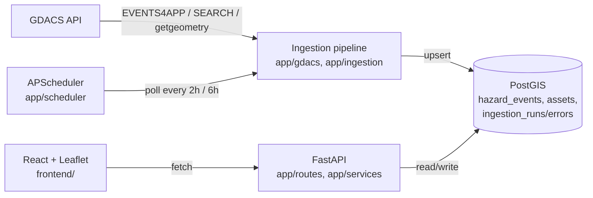
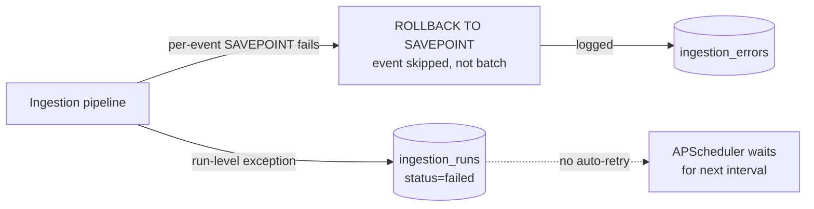

# ClimRisk — Architecture

South Africa-focused climate hazard exposure platform: a GDACS ingestion pipeline feeds a
PostGIS database, a FastAPI service exposes spatial-financial queries over it, and a React
dashboard visualizes hazard footprints against insured asset exposure. This document records
*why* the system is shaped the way it is — the decisions, the alternatives considered, and the
constraints that forced them — not just what the code does.

## System overview



Three deployable pieces: the ingestion service (scheduled + on-demand), the read/query API
(exposure intersection, map data), and the frontend (a static SPA that talks to the API over
HTTP). They share one database and nothing else — the frontend has no direct DB access, and the
ingestion pipeline has no dependency on the API layer.

**Failure path.** The happy path above hides a parallel error path that's equally load-bearing:



A malformed feature fails its own `SAVEPOINT` and is logged to `ingestion_errors` without aborting
the batch (see "Per-event fault isolation" below). A run-level exception (GDACS unreachable, DB
error before commit) is caught in [realtime.py](../app/ingestion/realtime.py) /
[polygons.py](../app/ingestion/polygons.py): the transaction rolls back, the error is logged, and
the run row is marked `failed` in `ingestion_runs` before the exception is re-raised. Both tables
are the only record of what went wrong — there's no alerting on top of them yet, so a stuck
ingestion currently surfaces only if someone queries `ingestion_runs`/`ingestion_errors` or reads
the process log.

## Backend

### Repository pattern over an ORM

[app/db/repository.py](../app/db/repository.py) is hand-written parameterized SQL via
`psycopg2`, not SQLAlchemy or another ORM. For a project this size, with PostGIS-specific
functions (`ST_MakePoint`, `ST_Intersects`, `ST_GeomFromGeoJSON`, `ST_AsGeoJSON`) on almost every
query, an ORM's geometry abstraction layer would add indirection without saving real effort —
the SQL is already short and the PostGIS calls are the point, not incidental. A plain
`SimpleConnectionPool` ([app/db/pool.py](../app/db/pool.py)) with a `get_connection()` context
manager is the whole data-access layer.

### Ingestion: three separate jobs, one shared processing path

[app/ingestion/](../app/ingestion) has `realtime.py`, `backfill.py`, and `polygons.py` — three
entry points, all funneling through [process_features()](../app/db/repository.py) in the
repository, which does the actual parse → filter → upsert → error-log work. Splitting them
matches GDACS's own API shape (EVENTS4APP is a global "current events" feed with no date range;
SEARCH is paginated historical; geometry is fetched per-event) and lets each run on its own
schedule (realtime every 2h, polygons every 6h — [app/scheduler/jobs.py](../app/scheduler/jobs.py)).

**Per-event fault isolation.** `process_features()` wraps each event in a `SAVEPOINT`/`ROLLBACK
TO SAVEPOINT`, so one malformed GDACS feature fails and gets logged to `ingestion_errors`
without aborting the whole batch or losing the events already processed in that transaction.
Commits are chunked (`ingest_commit_chunk_size`, default 20) rather than one commit per event or
one per batch — a balance between crash-safety and round-trip overhead.

**Scheduled job failures don't retry before the next interval, by design.**
[`_safe_realtime`/`_safe_polygons`](../app/scheduler/jobs.py) wrap each job in a bare
`try/except Exception: log.exception(...)` — a failed run (GDACS down, DB unreachable) is logged
and the job simply waits for its next `IntervalTrigger` tick (every 2h / 6h) rather than
backing off and retrying sooner. `max_instances=1` and `coalesce=True` mean a slow or stuck run
can't pile up overlapping executions, and a missed tick collapses into the next one instead of
firing a backlog. This is a coarser retry policy than the HTTP-level `tenacity` retries inside
each request — deliberately so: a whole-job retry loop competing with the next scheduled interval
would risk overlapping runs against the same rows. If a run fails after `start_run()` succeeded,
it's visible in `ingestion_runs`/`ingestion_errors` (see "Failure path" above); if the DB
connection itself never opens, the only record is the process log.

**Country filtering happens client-side, not server-side, on purpose.** GDACS's `SEARCH`
endpoint has a `country` query parameter — but it expects a full country name ("South Africa"),
not an ISO3 code, and silently returns `204 No Content` for any ISO3 value tested (confirmed
against multiple countries, not ZAF-specific). Rather than hardcode country names, `backfill.py`
fetches globally and relies on [`event_affects_country()`](../app/gdacs/parser.py) — the same
ISO3-based check already used for the realtime path — to filter locally. One correct filter
implementation, not two, and it isn't at the mercy of an undocumented upstream string format.
Documented in [README.md](../README.md#known-limitations).

**Footprint selection prefers area geometry over the marker point.** GDACS's geometry endpoint
returns `features[0]` as a bare `Point` (the event marker) followed by the real
`Polygon`/`MultiPolygon` footprint(s) — and for cyclones, dozens of per-forecast-point cone
polygons interleaved with track `LineString`s.
[`fetch_geometry()`](../app/gdacs/client.py) walks the feature list and returns the first
`Polygon`/`MultiPolygon` it finds, falling back to whatever geometry exists (a bare point) only
if no area geometry is present. This is a deliberately partial fix for cyclones — it stores the
first cone segment, not a unioned track corridor — rather than solving full multi-episode track
aggregation as a side effect of a bug fix.

**Geometry is validated and repaired before storage.**
[`validate_geometry()`](../app/gdacs/parser.py) runs Shapely's `make_valid()` on every incoming
footprint. GDACS's flood polygons are dense (thousands of vertices) and not always
topologically clean; `make_valid()` can legitimately return a `GeometryCollection` rather than a
clean `Polygon` when repairing a self-intersecting input. Downstream consumers (the intersection
query, the frontend) are written against generic PostGIS predicates (`ST_Intersects`,
`ST_Area(geography)`) that work correctly regardless of the exact geometry subtype, rather than
assuming `footprint` is always a `Polygon`/`MultiPolygon`.

### Database

**PostGIS only — no TimescaleDB.** Event volume for a single country is low (dozens to a few
hundred rows even across decades); a GiST index on `centroid`/`footprint` plus a plain btree on
`from_date` is the actual bottleneck-relevant index, not time-partitioning. Timescale would be a
second system to operate for no queried workload that needs it.

**Migration house style** ([db/migrations/](../db/migrations)): numbered (`NNN_topic.sql`),
header-commented, and every DDL statement is idempotent (`CREATE TABLE IF NOT EXISTS`,
`ADD COLUMN IF NOT EXISTS`, `CREATE INDEX IF NOT EXISTS`) so migrations are safe to re-run.
`BIGSERIAL` surrogate keys, `TIMESTAMPTZ` for every temporal column, `NUMERIC` for money/scores,
`JSONB` for raw/opaque payloads. Indexes are named `idx_<table>_<column>`, and partial indexes
are only added when they mirror a real query the application actually runs (e.g.
`idx_hazard_events_footprint_pending ... WHERE footprint IS NULL AND geometry_url IS NOT NULL`
exists because [`fetch_pending_polygons()`](../app/db/repository.py) runs exactly that filter).

**Dedup via a natural key, not the surrogate PK.** `hazard_events` has
`UNIQUE (event_type, event_id, episode_id)` — GDACS's own composite identifier — as the
`ON CONFLICT` target for upserts. The `id BIGSERIAL` surrogate key exists for foreign keys and
for the intersection service to name "one specific footprint row" unambiguously (see below), not
for dedup.

**Application role has no schema-modification rights, by design and by accident-turned-design.**
`climrisk_app` (the credential the app actually connects as) was originally granted nothing at
all on any table — a real bug caught by testing the live permission set rather than assuming the
migrations that created the tables also granted access to the app role. The fix
([005_grant_app_role.sql](../db/migrations/005_grant_app_role.sql)) grants `climrisk_app`
`SELECT/INSERT/UPDATE/DELETE` plus `ALTER DEFAULT PRIVILEGES` — so every table created by later
migrations (`assets` in `006`, and anything after) inherits the grant automatically, without a
per-migration grant statement, as long as they're applied by the same admin role. `climrisk_app`
still can't `CREATE TABLE` — schema changes require the table owner, matching how every migration
so far has actually been applied.

**`assets.total_insured_value` is a generated column, not application-computed.**
`GENERATED ALWAYS AS (building_value + contents_value) STORED` in
[006_assets.sql](../db/migrations/006_assets.sql) means TIV can never drift from its inputs —
there's no code path that writes `building_value` without `total_insured_value` recomputing, and
no risk of a forgotten recalculation in some other write path.

### Spatial-financial intersection service

[app/services/intersection.py](../app/services/intersection.py) is the one query the exposure
dashboard is built on: given a hazard event, find every asset whose `location` intersects its
`footprint`, and total their exposure.

**Takes `hazard_events.id` (the surrogate key), not GDACS's own `event_id`.** A single GDACS
`event_id` can have multiple `episode_id` rows over time as an event evolves, each with its own
footprint — "the event" isn't a single row. The surrogate key is the only unambiguous way to
name one specific footprint to intersect against.

**The intersection query passes the footprint as a subquery, not a join.**
```sql
SELECT ... FROM assets a
WHERE ST_Intersects(a.location, (SELECT footprint FROM hazard_events WHERE id = %s))
```
rather than joining `assets` to `hazard_events` and filtering on `h.id`. This keeps the GiST
index on `assets.location` doing the real work against one bound geometry, and keeps the query
legible as "assets vs. this one footprint" rather than a join whose filter placement the reader
has to reason about.

**A no-footprint event returns an empty result, not an error.** Not every ingested event has had
polygon enrichment run yet; `run_intersection()` checks `footprint IS NOT NULL` first and returns
zero assets with `has_footprint: false` rather than attempting (and failing) a spatial query
against a null geometry. A genuinely nonexistent `hazard_events.id` raises `ValueError`, which the
API layer maps to `404`.

**PML and Protection Gap are computed alongside Exposure, not deferred.** The ClimRisk Master
Document's Section 4.8 build sequencing puts both in this same step (Financial Dashboard), not a
later phase, so [`IntersectionResult`](../app/services/intersection.py) computes them as
properties on the same result Exposure already comes from — no second query, no separate
endpoint. `probable_maximum_loss = total_insured_value × damage_ratio`; `protection_gap =
total_insured_value − total_declared_insured_value`.

**The damage ratio is a documented approximation, not a calibrated model.**
[`app/services/damage_ratio.py`](../app/services/damage_ratio.py) hard-codes the HAZUS-MH/FEMA
band midpoints the master document cites (e.g. flood minor 0.05–0.15, flood major 0.30–0.60) —
cited convention, not invented numbers. The master document calibrates each band against
hazard-specific severity (flood depth in metres, cyclone category) that GDACS doesn't expose to
this pipeline; as a stand-in, GDACS's own `alert_level` (Green/Orange/Red) selects between a
hazard's "minor" and "major" band, and the band **midpoint** is used rather than calibrating
further within it — the same simplification the master document names explicitly as a future
improvement, not silently glossed over. Hazard types with no documented band (EQ, VO, DR) fall
back to a single conservative placeholder band, logged each time it's used so the fallback stays
visible rather than reading as a researched figure.

**Protection Gap treats an asset with no declared `insured_value` as fully uninsured, not
excluded.** `assets.insured_value` ([007_insured_value.sql](../db/migrations/007_insured_value.sql))
is nullable — most assets in a demo dataset won't have it populated. `total_declared_insured_value`
sums `insured_value OR 0` rather than skipping nulls, so an undeclared asset counts toward the gap
at its full TIV. This is a deliberate conservative default (matches the project's "state the
simplification" instinct elsewhere): it means the gap can currently overstate real uninsured
exposure for assets that are actually insured but just haven't had the field filled in, and that
trade-off is worth knowing before the number is quoted anywhere.

### Historical / trend service

[app/services/trends.py](../app/services/trends.py) answers the *other* question the dashboard
asks — how hazard frequency, alert level, and insured exposure have moved over time — and it
**does not** loop [`run_intersection()`](../app/services/intersection.py) once per event to do
it. That service opens its own connection and is shaped for "one footprint, in detail"; the
trend view needs the same TIV / PML / Protection-Gap numbers for *every* event at once, so
`run_hazard_trends()` uses a single grouped spatial join instead:

```sql
SELECT h.id, h.event_type, h.alert_level, ...,
       COUNT(a.id), COALESCE(SUM(a.total_insured_value), 0), COALESCE(SUM(a.insured_value), 0)
FROM hazard_events h
LEFT JOIN assets a ON h.footprint IS NOT NULL AND ST_Intersects(a.location, h.footprint)
WHERE h.iso3 = %s OR %s = ANY(h.affected_countries)
GROUP BY h.id ORDER BY h.from_date
```

The `LEFT JOIN` (not `INNER`) is load-bearing: an event with no footprint yet, or none of the
assets inside it, still comes back with zeroes rather than dropping out of the series — the same
"empty, not an error" contract the intersection service gives. The per-event financial formulas
(`probable_maximum_loss`, `protection_gap`) are duplicated as dataclass properties on
`HazardTrendPoint` that are **character-for-character the same** as `IntersectionResult`'s, and
both call the shared [`get_damage_ratio()`](../app/services/damage_ratio.py) — so the trend view
and the per-event panel can never quote different numbers for the same event.

**One endpoint, not pre-binned server-side.** `GET /trends/hazards`
([app/routes/trends.py](../app/routes/trends.py)) returns the whole event list, oldest first;
the frontend groups it into year buckets. A single country's history is tens to low hundreds of
rows — small enough that server-side aggregation would be structure without a payoff, and the
same list feeds both the frequency/alert-level charts (from `event_type` + `alert_level`) and
the financial trend (from `tiv_at_risk` / `probable_maximum_loss` / `protection_gap`).

### Parametric trigger rules engine (Phase 2)

[app/services/parametric.py](../app/services/parametric.py) is the first slice of Step 7:
index-based cover that pays a *predefined* amount when a *measurable* condition on a hazard event
is met, with no loss adjustment. Two tables ([008_parametric_triggers.sql](../db/migrations/008_parametric_triggers.sql)):
`parametric_triggers` (rule definitions) and `trigger_firings` (the rules that currently fire
against an event, with payout and basis risk).

**Conditions are a fixed AND-set of columns, not an expression language.** A rule can constrain
`event_type`, a `min_alert_level` floor (Green<Orange<Red ordinal), a `min_severity_value` floor,
the country affected, and whether the footprint must actually touch an insured asset
(`requires_exposed_assets`). Every non-NULL condition must hold. A rule DSL would be more
flexible and far harder to reason about for a demo with a handful of rules — the inputs here are
exactly the fields ClimRisk already trusts on `hazard_events` plus "does it hit the portfolio".

**Payout sizing and the asset gate reuse the intersection service, not a second spatial query.**
`per_asset` and `tiv_share` payouts, and `requires_exposed_assets`, all read one
[`run_intersection()`](../app/services/intersection.py) result computed once per event and shared
across every rule that needs it. `payout_kind` is one of `fixed` (flat), `per_asset` (× exposed
asset count), `tiv_share` (fraction × exposed TIV).

**Basis risk is measured against the modelled PML, not actual loss.** `basis_risk =
payout_amount − probable_maximum_loss` (signed: positive = the policy overpays for this event,
negative = it underpays). ClimRisk has no ground-truth loss data, so the PML from the damage-ratio
model is the only available yardstick — the same documented approximation the exposure dashboard
already surfaces, reused rather than a new one invented here.

**`trigger_firings` is a live payout ledger, not an evaluation log.** The engine upserts a row
when a rule fires and **deletes** it when re-evaluation shows the rule no longer fires (a
tightened threshold, a footprint that changed). So the table always reads as "outstanding
parametric payouts". Non-firing evaluations are returned by `POST /parametric/evaluate/{id}`
with a `reason` string, but not persisted — matching the "don't add structure without a problem"
instinct elsewhere.

**Rule writes and evaluation are gated by the same optional key as `/ingest/*`.** Creating,
editing, deleting a rule, and triggering evaluation are operational actions behind
`require_ingest_api_key` ([deps.py](../app/routes/deps.py)); the reads (`GET /parametric/triggers`,
`GET /parametric/firings`) are open like the other read routes.

**A scheduled sweep re-evaluates every stored event, on the same coarse policy as ingestion.**
[`_safe_parametric`](../app/scheduler/jobs.py) wraps `evaluate_all_events()` in a bare
`try/except` with `max_instances=1`, `coalesce=True`, on `parametric_interval_hours` (default 6,
matching polygon enrichment so footprints are current first). A failed sweep is logged and waits
for the next tick — no sooner retry. Set `PARAMETRIC_AUTO_EVALUATE=false` to run it on demand only.

### API layer

Plain `APIRouter` per domain ([health](../app/routes/health.py),
[exposure](../app/routes/exposure.py), [hazards](../app/routes/hazards.py),
[assets](../app/routes/assets.py), [trends](../app/routes/trends.py),
[parametric](../app/routes/parametric.py)) — one file per concern, no shared "god router". No
`/api` prefix, matching the routes that existed before the frontend was added, rather than
introducing a second convention partway through the project. `/parametric` is the one router with
a shared path prefix — it carries a cluster of related routes (`/triggers`, `/firings`,
`/evaluate`) rather than a single verb.

**Errors are translated, not passed through.** `exposure.py` catches the service's `ValueError`
(unknown ID → `404`) and `psycopg2.Error` (→ generic `500`, real exception logged server-side but
not sent to the client) rather than letting FastAPI's default handler leak raw exception text.

**`/hazards` and `/assets` return GeoJSON `FeatureCollection`s**, not a bespoke JSON shape —
`react-leaflet`'s `<GeoJSON>` component consumes that format directly, so the API's response
shape *is* the frontend's input shape with no translation layer in between.

**CORS is configuration, not a hardcoded origin list.** `cors_allowed_origins` in
[app/config.py](../app/config.py) is a comma-separated setting (matching the existing
`gdacs_event_types` pattern), defaulting to the Vite dev server origins — added only once the
frontend actually needed cross-origin requests, not speculatively.

**`/ingest/*` is gated by an optional API key; everything else is still open.**
[`require_ingest_api_key`](../app/routes/deps.py) checks a shared-secret `X-API-Key` header
against `INGEST_API_KEY` for the four ingest routes in
[health.py](../app/routes/health.py) — the three job triggers plus `/ingest/runs`, since it
exposes internal operation detail. Unset (the default), the dependency is a no-op and those
routes behave exactly as before, matching local/dev use. The read endpoints
(`/hazards`, `/assets`, `/exposure/*`, `/health*`) have no auth at all — they're read-only and
lower-risk than the ingest triggers, but that's still a gap worth closing (or fronting with
network-level restriction) before this runs anywhere reachable outside a trusted network.

## Frontend

[frontend/](../frontend) — Vite + React 19 + Tailwind v4 + `react-leaflet` + `lucide-react`, a
static SPA with no server-side rendering, since every data need is already served by the FastAPI
backend as JSON/GeoJSON.

**State lives in `App.jsx`, not a global store.** Hazards, assets, the selected hazard, and the
current intersection result are `useState`/`useMemo` in one component, passed down as props. The
data model is small enough (a handful of related queries, no deeply nested update patterns) that
Redux/Zustand/Context would be structure without a problem to solve yet.

**Hazard-type colors and asset-TIV-tier colors are deliberately disjoint palettes.** An early
version used the same hue family for both (rose/amber/cyan for asset tiers, overlapping
earthquake/cyclone/flood's colors) — caught during manual testing, not by design review, and
fixed to a separate violet/indigo ramp for assets ([theme.js](../frontend/src/lib/theme.js)) so
polygon and marker color never collide, not just their shapes.

**Rapid hazard re-selection is guarded against out-of-order responses.**
[`loadIntersection`](../frontend/src/App.jsx) stamps each call with an incrementing request id
(`intersectionRequestRef`); if a user selects hazard A then B before A's
`/exposure/intersect/A` response lands, A's late-arriving response is dropped instead of
overwriting the newer state for B, because it no longer matches the ref's current value by the
time it resolves. Deliberately a plain ref counter, not an `AbortController` — the in-flight
request for A isn't cancelled (cheap enough not to bother), just ignored on arrival.

**The BI estimator deliberately still totals against full TIV, not PML.** The panel computes
`Σ(daily_net_revenue × variable_cost_ratio) × outage_days` and shows it next to full TIV as
"Property + BI total" — the ceiling (Section 4.1's definition), on purpose, even though PML now
exists as a separate metric elsewhere on the same panel. Conflating the two inside one component
would blur "maximum possible liability" with "probability-weighted estimate," which is exactly
the distinction Section 4.3 draws ("PML should never exceed TIV"); showing both side by side,
computed independently, keeps that distinction visible instead of picking one number to present
as *the* answer. Same instinct as the backend's honest ML-layer scoping: state the simplification
rather than let a number imply more confidence than the underlying model has.

**The trend view is a top-level view switch, not a third panel.** [App.jsx](../frontend/src/App.jsx)
toggles between the live map+exposure split and a full-width
[TrendsPanel](../frontend/src/components/TrendsPanel.jsx) rather than trying to wedge time-series
charts into the 35% exposure column — a time axis needs width. State for the switch is one more
`useState` in `App.jsx`, consistent with "state lives in `App.jsx`".

**`recharts` is code-split and the trend data is lazy-loaded.** `TrendsPanel` is a
`React.lazy` import and `/trends/hazards` is only fetched the first time the user opens the view
— `recharts` is ~450 kB (bigger than the entire rest of the bundle) and the map is the default
view most sessions never leave, so neither the library nor the query is on the initial-load
path. The build emits it as a separate `TrendsPanel-*.js` chunk.

**Charts reuse the existing palettes, not new ones.** The frequency chart stacks by
`HAZARD_COLORS` (same hues as the map polygons); the alert-level chart uses a `Red/Orange/Green`
ramp pulled into [theme.js](../frontend/src/lib/theme.js) as `ALERT_COLORS`, matching the alert
badge styling already in `ExposurePanel`. No chart introduces a colour the rest of the app
doesn't already use.

## Testing approach

[tests/test_exposure.py](../tests/test_exposure.py) is an integration test against the real
database via `DATABASE_URL` — no mocked DB layer. It reuses a real, already-ingested hazard event
(`FL 1101354`) rather than synthetic geometry, inserts a controlled inside/outside asset pair
so the assertion proves `ST_Intersects` discriminates real geometry (not just "returns
something"), and cleans up its own rows in a fixture teardown. The same
insert-verify-clean-up-and-confirm-cleanup pattern was used manually throughout development
(PostGIS round-trip checks, the polygon-enrichment fix, the `/exposure/intersect` endpoint) before
being formalized into this one automated test.

## Known limitations / deliberate scope boundaries

Items below describe the system **as built today**. The ML-related bullet is the exception: no
ML/classification code exists anywhere in this repo yet — it's recorded here as roadmap context
for why the current schema and country scope were chosen, not as a description of a present
architectural layer. (The parametric-trigger engine, by contrast, *is* now present — see
"Parametric trigger rules engine" above.)

- **`/ingest/*` has an optional API-key gate; read routes have no auth at all** — see "API layer"
  above. `INGEST_API_KEY` is unset by default, so set it before running outside a trusted network.
- **SAWS (South African Weather Service) is not integrated** — GDACS only, so far. Access terms
  need verifying before that's a real Phase 2 dependency, not an assumed one.
- **Cyclone footprints are one cone segment, not a track corridor** — a known, documented
  simplification, not an oversight (see "Footprint selection" above).
- **PML uses a documented approximation, not a calibrated damage model** — the damage ratio is a
  HAZUS-MH/FEMA band midpoint selected by `alert_level`, not hazard-specific severity (flood
  depth, cyclone category) — see "The damage ratio is a documented approximation" above. EAL
  (Expected Annual Loss) is still a future phase; no code for it exists yet.
- **Parametric basis risk is measured against modelled PML, not actual loss** — the engine
  ([app/services/parametric.py](../app/services/parametric.py)) exists and evaluates rules, but
  `basis_risk = payout − PML`, and PML is itself the documented approximation above. There is no
  ground-truth loss feed to calibrate against. Rule conditions are also limited to
  `event_type` / `alert_level` / `severity_value` / country / footprint-intersects-portfolio —
  no per-hazard index (wind speed, flood depth, rainfall) yet.
- **Single-country focus (ZAF)** — the historical event count for South Africa alone is small.
  Pooling comparable Sub-Saharan/Southern Hemisphere climates was flagged in planning as likely
  necessary before any future ML classification work — noted here for that context, not because
  such work is in progress.

## Current status

Against the ClimRisk Master Document's Build Order (Section 6): **Phase 1 (Steps 1–6) complete
and verified against the live database. Phase 2, Step 7 (parametric trigger rules engine) —
first slice built: schema, engine, API, and a scheduled evaluation job.**

Migration `007` has been applied — `/assets`, `/exposure/*`, `/trends/hazards`, and
`tests/test_exposure.py` all pass against the running DB. Migration `008` (parametric triggers)
is code-complete and **must be applied the same way** (as the table owner) before the
`/parametric/*` routes work — see "Immediate next action" below.

| Step | What | Status |
|---|---|---|
| 1 | Data pipeline (GDACS → PostGIS, scheduled) | Done |
| 2 | Asset model | Done — including `insured_value` (migration `007`, applied) |
| 3 | Intersection logic, tested | Done |
| 4 | Map interface | Done (colour-coded by hazard type rather than alert level — a deliberate deviation, alert level shown as a badge instead) |
| 5 | Financial dashboard: Exposure, BI Loss, **PML, Protection Gap** | Done — verified against the live DB (`/exposure/intersect/*`, `tests/test_exposure.py` pass) |
| 6 | Historical/trend view | Done — `/trends/hazards` + [`app/services/trends.py`](../app/services/trends.py), code-split `recharts` view behind the header "Trends" toggle; verified live |
| 7 (Phase 2) | Parametric trigger rules engine | **First slice done** — [`008_parametric_triggers.sql`](../db/migrations/008_parametric_triggers.sql), [`app/services/parametric.py`](../app/services/parametric.py), `/parametric/*` routes, scheduled sweep, [`tests/test_parametric.py`](../tests/test_parametric.py). Needs migration `008` applied. Rule conditions & basis-risk yardstick still coarse — see Known limitations. |
| 8 (Phase 3) | Climate disclosure report export | Not started |

**Immediate next action:** apply `db/migrations/008_parametric_triggers.sql` against the live
database, **as the table owner** (`climrisk_app` can't `CREATE TABLE`):

```bash
psql "postgresql://postgres@localhost:5432/ClimRisk" -f db/migrations/008_parametric_triggers.sql
```

Until it's applied, `/parametric/*` fails on the missing tables and `tests/test_parametric.py`
skips (6 tests). Migration `007` is already applied, so Steps 5–6 are live.

**Not started at all:** the ML layer (Section 5) — no Layer 1 forecast-API integrations (Fire
Weather Index, Google Flood Hub), no Layer 2 model, no `pandas`/`scikit-learn` in
`requirements.txt`. Expected at this point — the master document's own roadmap sequences it after
Phase 1's financial layer is solid, which is what Step 5 completing now unblocks.
